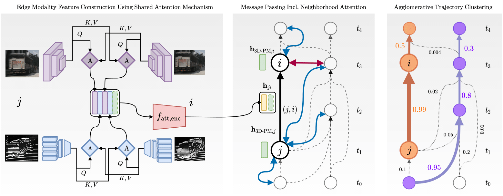

# Batch3DMOT
[**arXiv**](https://arxiv.org/abs/XXXX.XXXXX) | [**website**](http://batch3dmot.cs.uni-freiburg.de/)

This repository is the official implementation of the paper:

> Offline 3D Multi-Object Tracking Using Graph Neural Networks with Cross-Edge Modality Attention
>
> [Martin Büchner](https://rl.uni-freiburg.de/people/buechner)  and [Abhinav Valada](https://rl.uni-freiburg.de/people/valada).
>
> *arXiv preprint arXiv:XXXX.XXXXX, 2022

<p align="center">
  
</p>

If you find our work useful, please consider citing our paper:
```
@article{buechner2022batch3dmot,
	  title={3D Multi-Object Tracking Using Graph Neural Networks with Cross-Edge Modality Attention},
	  author={B{\"u}chner, Martin and Valada, Abhinav},
	  journal={arXiv preprint arXiv:XXXX.XXXX},
	  year={2022}
}
```

## 📔 Abstract

Online 3D multi-object tracking (MOT) has witnessed significant research interest in recent years, largely driven by demand from the autonomous systems community. However, 3D offline MOT is relatively less explored. Labeling 3D trajectory scene data at a large scale while not relying on high-cost human experts is still an open research question. In this work, we propose Batch3DMOT that follows the tracking-by-detection paradigm and represents real-world scenes as directed, acyclic, and category-disjoint tracking graphs that are attributed using various modalities such as camera, LiDAR, and radar. We present a multi-modal graph neural network that uses a cross-edge attention mechanism mitigating modality intermittence, which translates into sparsity in the graph domain. Additionally, we present attention-weighted convolutions over frame-wise k-NN neighborhoods as suitable means to allow information exchange across disconnected graph components. We evaluate our approach using various sensor modalities and model configurations on the challenging nuScenes and KITTI datasets. Extensive experiments demonstrate that our proposed approach yields an overall improvement of 2.8% in the AMOTA score on nuScenes thereby setting a new benchmark for 3D tracking methods and successfully enhances false positive filtering.

## 👨‍💻 Code Release

We will make the code publicly accessible upon acceptance of our paper.


## 👩‍⚖️ License

For academic usage, the code is released under the [GPLv3](https://www.gnu.org/licenses/gpl-3.0.en.html) license.
For any commercial purpose, please contact the authors.
